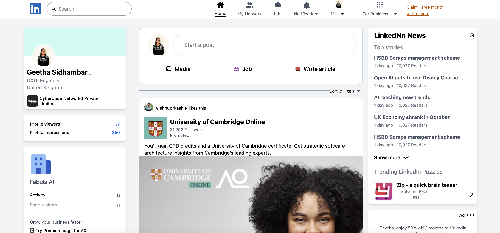

## 💻LinkedIn cloning

Cloning LinkedIn page to understand the layout structure ad responsiveness using Tailwindcss classes.

## 💻 Technologies Used

- HTML
- Tailwindcss
 
🚀 link:https://linkedin-cloning.vercel.app/

#Challanges: 

🚀 Header section 

 - Making responsiveness of each elements  and focus each section to make responsible to the screen size . ex:mobile

## 🚀 Tools Used
• VSCode for coding and Live Preview plugin
• Netlify
• Github
