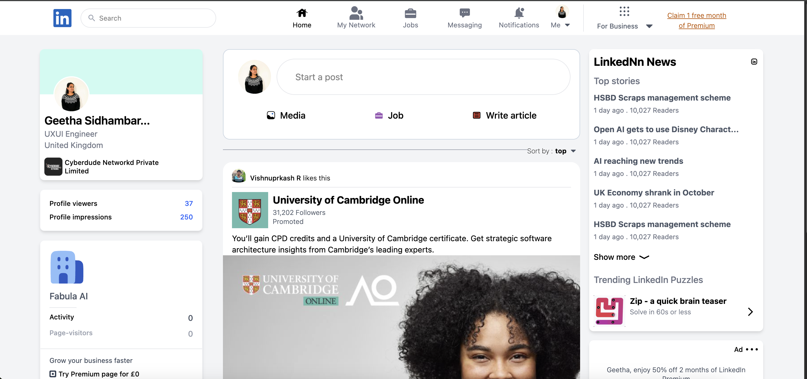

## 💻LinkedIn cloning

## 💻 Technologies Used

- HTML
- Tailwindcss
 
🚀 link:https://linkedin-cloning.vercel.app/

#Challanges: 

 - Making responsiveness of each elements took time , focus each section to make responsible to the screen size . ex:mobile
 - First, header section search var section  
     1. hide searchbar container show mobile-icon only - <input class="hidden sm:block" />
     2. Show icon only to the navlinks -  <li class="w-20 hidden sm:block">
     3. Right most nav link hidden - 

     4. sm:block to hide text-2xl
     5. sm-flex to hide icon

## 🚀 Tools Used
• VSCode for coding and Live Preview plugin
• Netlify
• Github
